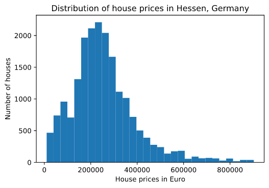

# Should I invest in real estate to address the challenge of negative interest rates?

## Introduction

Economies world-wide are facing historically low, or even negative interest rates. Especially in Europe, and in particular in Germany the question that many people ask themselves is: Where should I invest my money? Investing in real estate is an adequate option, but what are key factors that influence the price of a house? What is a fair price? In which region should I invest and what are the dominant features that influence the house prices most?

Many people have an opinion on theses questions. But what does the data tell us about house prices?

In order to gain some insights on house prices in Hessen, a German Bundesland, I used data provided via Kaggle by Orges Leka: "Hessen House Prices Dataset". The data set contains information about 22000 houses with pricing information from Hessen in Germany.

Each record of the data set contains between 20 and 30 features. Out of these features, only a subset might be relevant for determining house prices. Not all houses in the data set have the same features.  

## Part I: How do house prices vary across the German Bundesland Hessen?

Before investing in real estate, one need to understand the potential financial effort that must be taken into consideration for buying a house. The histogram below nicely shows that house prices range from relatively small amounts up to 1 million Euro. However, the vast majority of houses are being sold for an amount in a range between 200k€ and 400k€. This is the amount you would need to have available in order to be able to select a house from a broader range of offers.

*Please be aware that heavy outliers (house prices below 10k€ and above 1 million Euro) have been excluded from the analysis.*

## Part II: How do the different characteristics of a house correlate to each other?

It is interesting to know, whether there are some characteristics, which do heavily correlate to each other. Examples could be: Does the heating system of a house correlate with the year of construction? Or is the natural assumptions that the number of rooms correlates with the size of the living area really true?

The heatmap below provides an overview how the different characteristics of house correlate to each other. The biggest correlation does indeed exist for "number of rooms" with "Size of the living area".

For the house price, characteristics like Wohnflaeche, Zimmer, and Baujahr seem to correlate well. We will look into this in more detail in the next chapter.

## Part III:  What are the most dominant characteristics that determine the price of a house?

This might be the most important question: Which characteristics do have the highest impact on the price? Having a good understanding of these characteristics will help you to chose your new house carefully.

According to this analysis, the characteristics Zimmer, Baujahr, Verfuegbar_ab_Jahr and Grundstuecksflaeche have the highest positive influence on the house price. These are the characteristics that dominate the price of a house most.

## Part IV: Which sub-regions (=PLZ) do have the highest, respectively the lowest house prices?

The next important question when buying a house is around the region and the prices in that region. The available data set provides information about the location via the column "plz".

The bar chart below provides the plz's with the highest and the lowest prices.

*Special care must be taken for this analysis, as the data around plz was very rudimentary.*

## Conclusion

The analysis of house prices in Hessen, Germany, has provided some useful insights. If you consider investing in real estate you should plan to invest at least 200k€ - 400k€. There are huge price differences between the various sub-regions. You should check house offers especially for the characteristics Zimmer, Baujahr, Verfuegbar_ab_Jahr and Grundstuecksflaeche. These are the characteristics with the highest impact on the price.

Now it is the time to start. Check out the offers that are available and carefully take into considerations the insights provided by this study.
